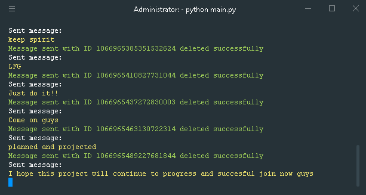

<h3>Bahasa Indonesia</h3>
<bt/>

 

## Cara ambil akses token:
- Pertama silahkan buka discord.com
- terus kalian klik "Open Discord in your browser"
- Kemudian kalian klik Pojok Kanan Titik Tiga
- Terus klik More Tools > Developer Tools
- Kemudian klik "Application"
- dibagian atas, kemudian klik "Storage"
- Pilih Local Storage, Pilih Discord.com
- kalian cari dipencarian, ketik "Token"
- Nanti keluar hasilnya tokennya.
 

## Cara menjalankannya menggunakan Termux:
- pkg install git
- git clone https://github.com/xsrazy/discord-bot
- pkg install python
- apt upgrade && update
- pkg install openssl
- pip install requests colorama
- cd discord-bot
- python main.py
- Edit your token at token.txt
- Edit your message at message.txt
 

## Cara menjalankannya menggunakan Laptop/PC:
- install git
- git clone https://github.com/xsrazy/discord-bot
- cd discord-bot
- install python
- pip install -r requirements.txt
- python main.py
- Edit your token at token.txt
- Edit your message at message.txt
 

## Hehe

